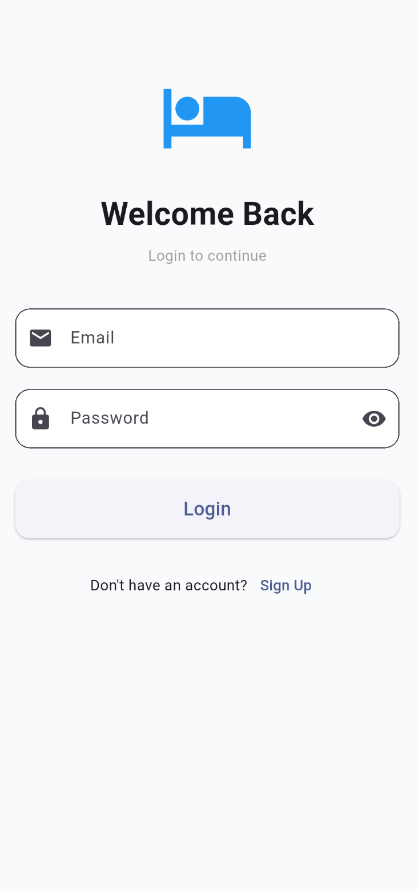
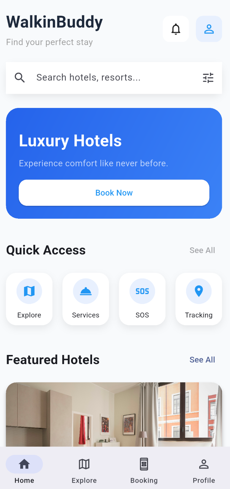
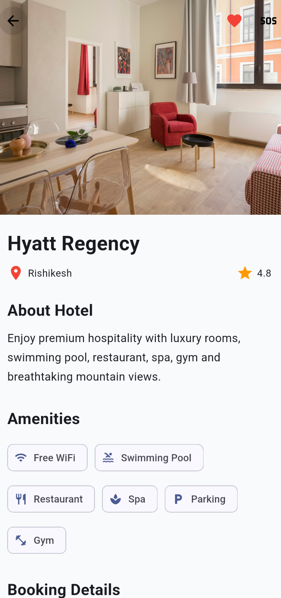
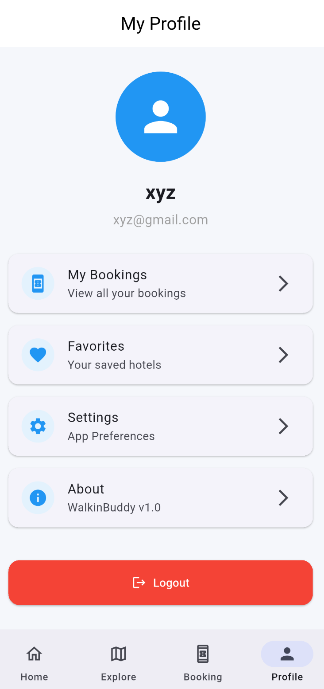
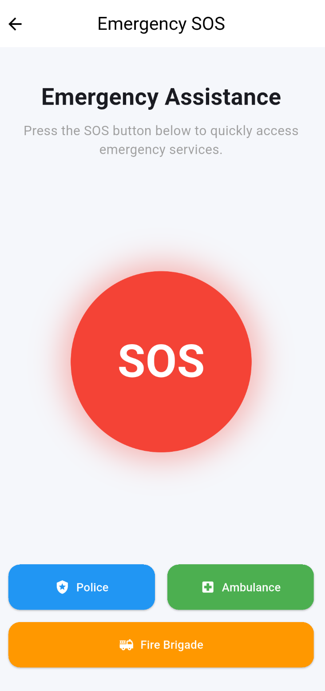

# 🏨 WalkinBuddy

A modern **Flutter-based Smart Hospitality & Safety App** that allows users to discover hotels, make bookings, manage their profile, and use emergency SOS services through a clean and user-friendly interface.

---

# ✨ Features

## 🔐 Authentication

- Login
- Signup
- Forgot Password
- Firebase Authentication

## 🏨 Hotel Management

- Browse Featured Hotels
- Hotel Details
- Search Hotels
- Hotel Booking

## 💳 Payment

- Multiple Payment Options
- Booking Confirmation

## ⭐ Reviews

- Add Reviews
- Ratings

## 👤 User Profile

- Edit Profile
- Booking History

## 🚨 Safety

- SOS Emergency Screen

## 🎨 UI

- Modern Material 3 Design
- Responsive Layout
- Clean User Interface

---

# 🛠 Tech Stack

- Flutter
- Dart
- Firebase Authentication
- Cloud Firestore
- Firebase Storage
- Provider
- Material 3

---

# 📂 Project Structure

```text
lib/
│
├── core/
│   ├── theme/
│   └── utils/
│
├── features/
│   ├── auth/
│   ├── booking/
│   ├── home/
│   ├── hotel/
│   ├── payment/
│   ├── profile/
│   ├── review/
│   ├── settings/
│   └── sos/
│
└── main.dart
```

---

# 📱 Screens

- Splash Screen
- Login
- Signup
- Home
- Hotel Details
- Booking
- Payment
- Reviews
- Profile
- Settings
- SOS

---

# 📸 Screenshots

# 📱 Screens

- Splash Screen
- Login
- Signup
- Home
- Hotel Details
- Booking
- Payment
- Reviews
- Profile
- Settings
- SOS

---

# 📸 Screenshots

| Login                                                       | Home                                                       |
| ----------------------------------------------------------- | ---------------------------------------------------------- |
|  |  |

| Hotel Details                                                       | Booking                                                       |
| ------------------------------------------------------------------- | ------------------------------------------------------------- |
|  |  |

| Profile                                                       | SOS                                                       |
| ------------------------------------------------------------- | --------------------------------------------------------- |
|  |  |

---

# 🚀 Getting Started

## Clone Repository

```bash
git clone https://github.com/AmitS-22/WalkinBuddy.git
```

---

# 🚀 Getting Started

## Clone Repository

```bash
git clone https://github.com/AmitS-22/WalkinBuddy.git
```

## Open Project

```bash
cd WalkinBuddy
```

## Install Packages

```bash
flutter pub get
```

## Run App

```bash
flutter run
```

---

# 📋 Requirements

- Flutter 3.44+
- Dart 3.12+
- Android Studio / VS Code
- Firebase Project

---

# 🔮 Future Improvements

- AI Hotel Recommendation
- Online Payment Gateway
- Push Notifications
- Hotel Wishlist
- Dark Mode
- QR Check-in

---

# 👨‍💻 Developer

**Amit Singh Bhandari**

- GitHub: https://github.com/AmitS-22
- LinkedIn: https://www.linkedin.com/in/amit-singh-bhandari-5ba207303/

---

# 📄 License

This project is developed for learning, portfolio, and demonstration purposes.
